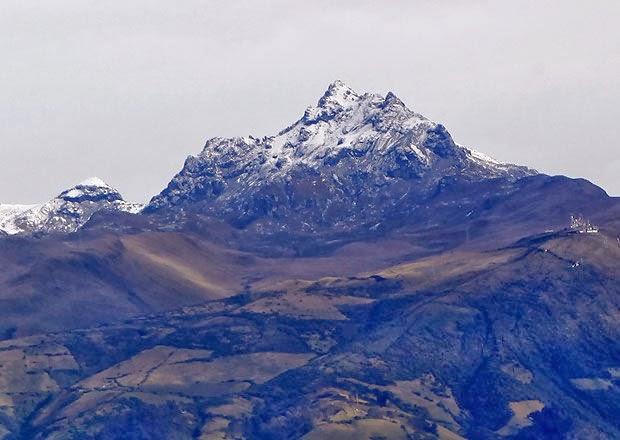
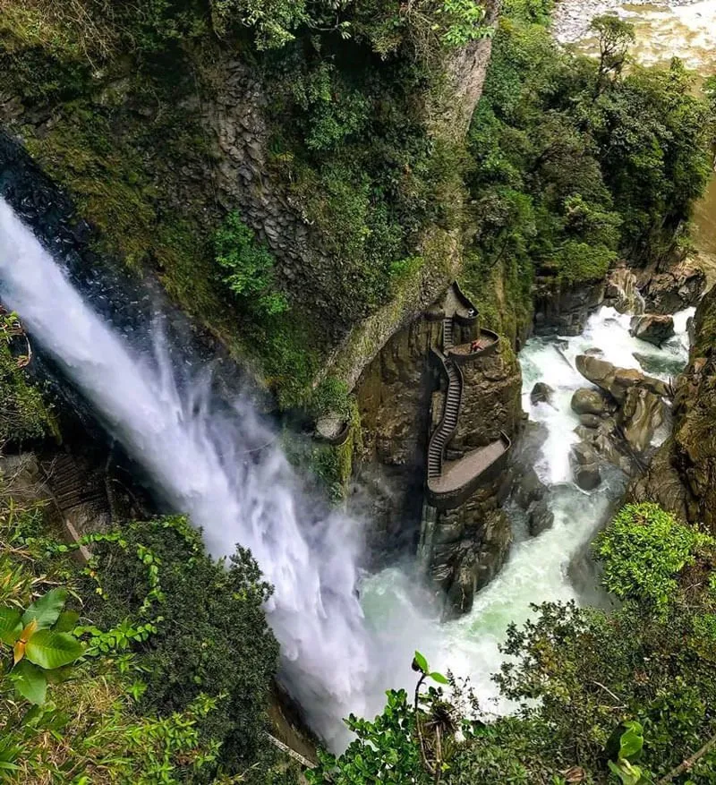
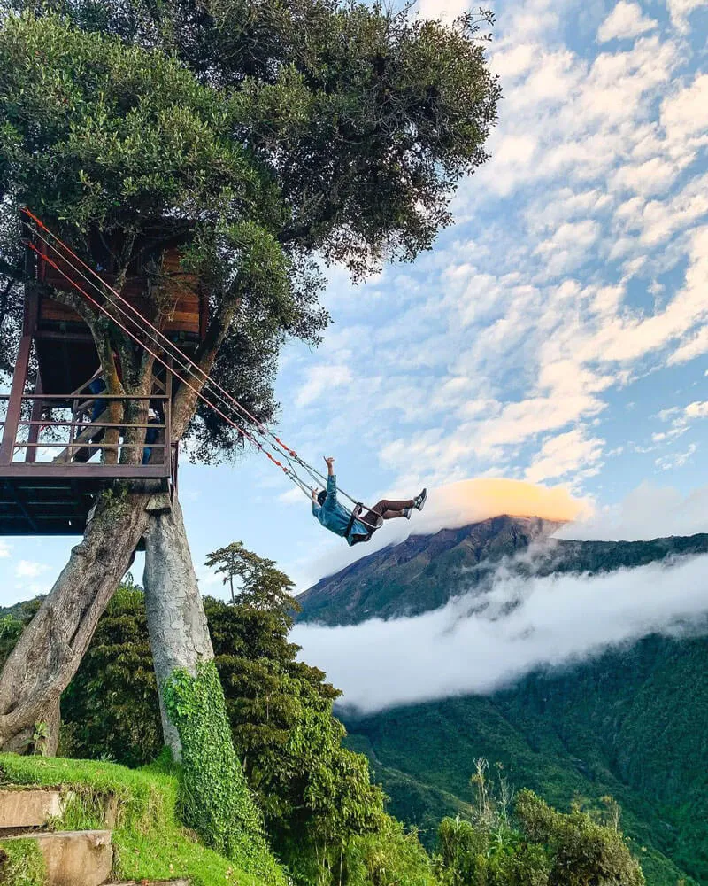
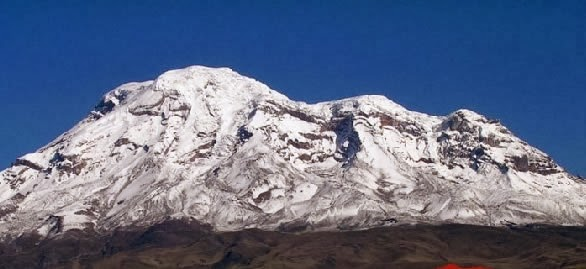

# La Sierra Ecuatoriana

**El Panecillo**
El Panecillo es una elevación natural de 3.000 metros sobre el nivel del mar, enclavada en el corazón mismo de la ciudad de Quito. Un atractivo turístico de la capital de Ecuador que no pueden dejar de visitar.

**Volcán Pichincha**
El Pichincha es un volcán de Ecuador. La capital ecuatoriana, Quito, se encuentra en sus faldas. Presenta varias cumbres, que en la siguiente lista están mencionadas desde la geológicamente más vieja al noreste hasta la más nueva al suroeste. En esta ruta de montaña los participantes podrán alcanzar los 4.630metros sobre el nivel del mar. Además, podrán disfrutar de los jardines de Chuquiragua hasta llegar a la cumbre Cruz de los Caminantes y admirar el inigualable paisaje desde el mirador del cráter.

**Pailón del Diablo**
Baños tiene un sinnúmero de cascadas, y una de las más conocidas es el Pailón del Diablo. Esta famosa cascada se encuentra ubicada a 17 kilómetros de la ciudad de Baños de Agua Santa, específicamente en la parroquia de Río Verde, y su nombre real es cascada río Verde, aunque el nombre del Pailón del Diablo es el que se ha popularizado. Esta caída de agua de 80 metros de altura y una profundidad de 20 metros, es un ícono del turismo en el Ecuador, y se ha convertido en un destino top de Baños.

**Casa del árbol o columpio del fin del mundo**

La Casa del Árbol es uno de los sitios insignes de Baños. Se encuentra ubicada en las faldas del volcán Tungurahua en la zona de Runtún, a 2.660 metros sobre el nivel del mar y se constituye como un mirador perfecto para admirar el imponente volcán Tungurahua y su actividad volcánica. Adicionalmente, en la Casa del árbol encontrarás el famoso columpio del fin del mundo, un conocido atractivo turístico. Al columpiarte sobre él te encontrarás sobre una pendiente bastante pronunciada que te hará sentir como si estuvieras volando sobre un acantilado.

**Volcán Chimborazo**

El Chimborazo, con sus imponentes 20.560 pies de altura sobre las tierras costeras a un lado, y sobre la selva amazónica al otro, el Chimborazo es el pico más alto del Ecuador y el decimoséptimo del mundo. Una curiosidad acerca del Chimborazo es que su cima constituye el punto más lejano de la superficie terrestre con respecto al centro del planeta.

