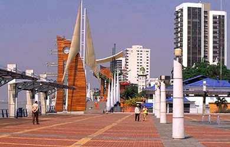
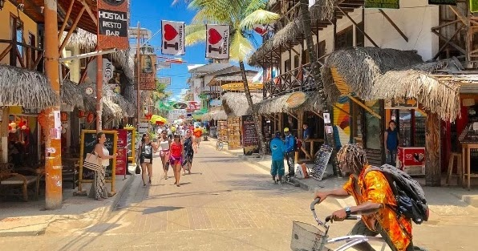
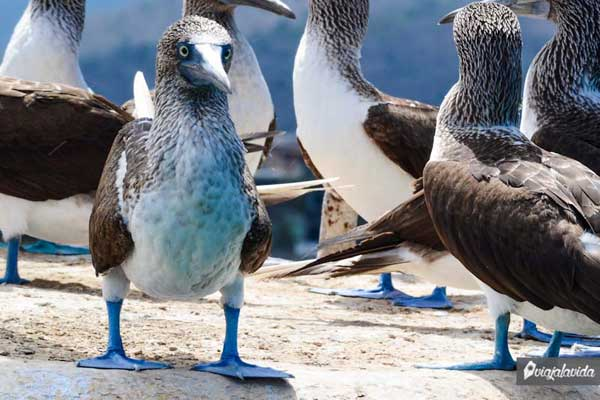
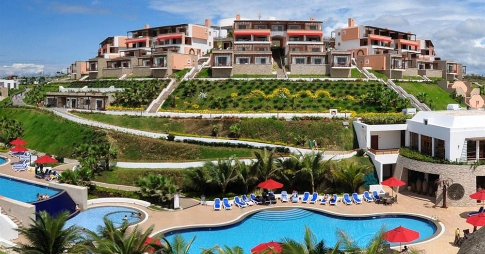

# La Costa Ecuatoriana 

**Malecón 2000**

Malecón 2000, ubicado en la ciudad de Guayaquil, junto al río Guayas, es un proyecto de regeneración urbana del antiguo Malecón Simón Bolívar, de 2.5 km de extensión en donde se puede disfrutar de los grandes monumentos de la historia de Guayaquil, como el Hemiciclo de la Rotonda, museos, jardines, fuentes, centro comercial, restaurantes, bares, patios de comida, el primer cine IMAX de Sudamérica, así como muelles, desde donde se puede abordar embarcaciones para realizar paseos diurnos y nocturnos por el río Guayas y miradores entre otras atracciones turísticas.

**Montañita**

Un pequeño pueblo convertido en punto de encuentro para todo turista que visita el Ecuador; encuentras gente de distintas partes del mundo, atraídos por sus reconocidas olas, buen clima, el agradable estilo de vida bohemio y las entretenidas farras nocturnas que goza el lugar, donde cada día de la semana hay una fiesta distinta. Si piensas ir por un día, de seguro no lograrás salir ni al segundo.

**Puerto López**

Este rinconcito de Manabí es famoso por sus avistamientos de ballenas en los meses de junio a noviembre, pero dispone también de otros atractivos turísticos como el paseo y la práctica de snorkel en la Isla Salango e Isla de la Plata, en ambas se puede observar animales llamativos como los Piqueros Patas Azules.

**Mompiche**

Olas para surfear, atardeceres sorprendentes, restaurantes exquisitos, playas únicas (Playa Negra), el pueblo perfecto para todo viajero (también te encuentras con personas de diferentes países) que desee hacer una parada con la finalidad de recargar energías en su recorrido por el Ecuador.

